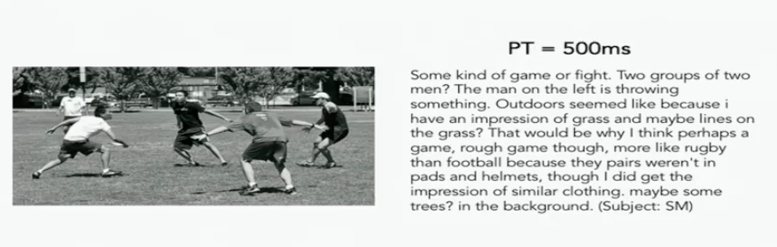

## 01 [Introduction to CNN for Visual Recognition](https://youtu.be/vT1JzLTH4G4)

* 计算机视觉图谱

* 计算机视觉发展历史

  生物视觉形成，神经元处理视觉信息，产生行为。

  相机产生，机器能接收视觉信息。

  计算机视觉开始（1960s）将对象转换为更简单的形状及其几何配置的集合。

  SIFT，Histogram of Gradients（HoG），Deformable Part Model

* 计算机视觉问题包括图像分类，对象定位，对象检测和场景理解。

* Imagenet 是目前可用的图像分类中最大的数据集之一。

* 从Imagenet竞赛开始2012年，CNN（卷积神经网络）总是获胜。

* CNN实际上是由Yann Lecun于1997年发明的。

* 看图写作（图像识别结合NLP，类似小学的看图写作，甚至可以识别图中是什么人，有什么关键性信息，加入逻辑分析）

  

